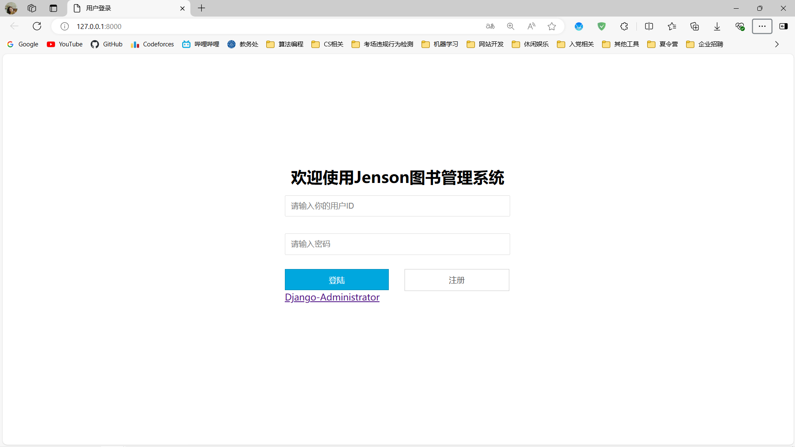
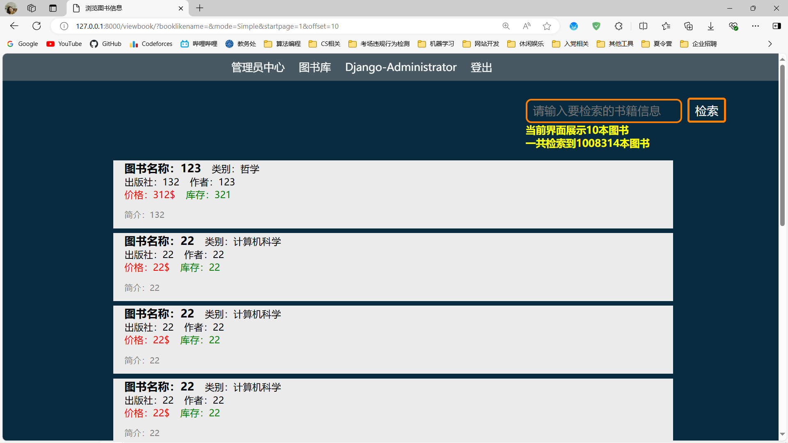

# Book_Management_System_for_Database_Course
A simple book management system made for the NUAA Database Principle course. The system is made up of Web and database connected is Open Gauss in Huawei. The Web technology is Django + HTML + JavaScript, the programming language is Python. It is easy to change the connection database from Open Gauss to popular Database Systems such as SQL Server, MySQL, Oracle and so on. When configuring the local database, it can run by 'python manage.py runserver' provided by Django. But before that, it should run command 'python manage.py makemigrations' and 'python manage.py migrate' to make sure the database configuration is right.

